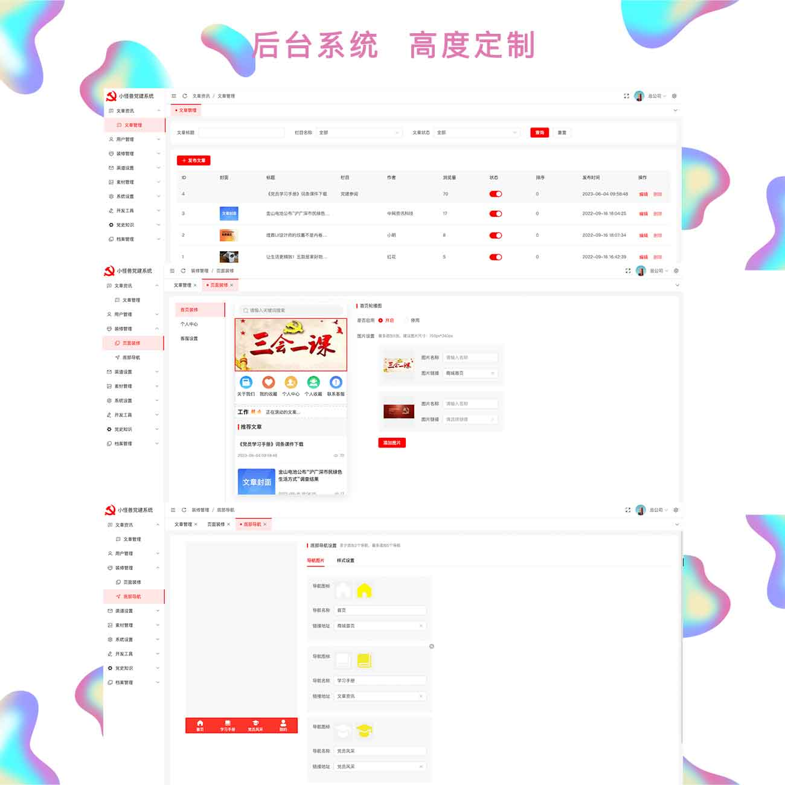

<!-- PROJECT LOGO -->
 

  

<h3 align="center">小怪兽党建系统开源版</h3>
  

    大家觉得这个项目还不错，请大家给上一个您宝贵的star，谢谢！
     
    <a href="https://gitee.com/it-lynx/open-party"><strong>查看文档 »</strong></a>
     
     
    <a href="https://gitee.com/it-lynx/open-party">查看演示</a>
    ·
    <a href="https://gitee.com/it-lynx/open-party/issues">提交问题</a>
    ·
    <a href="https://gitee.com/it-lynx/open-party/issues">反馈问题</a>
  

<!-- ABOUT THE PROJECT -->
## 程序演示

(<a href="#readme-top">返回顶部</a>)

## 项目web地址

后台地址 :  [http://open-party.qhxgs.cn/admin](http://open-party.qhxgs.cn/admin) 账号:admin123 密码:admin123

项目地址 : [点击进入](https://gitee.com/it-lynx/open-party)

(<a href="#readme-top">返回顶部</a>)

<!-- GETTING STARTED -->
## 项目简介

青海小怪兽网络科技有限公司开发了一款智慧党建系统，该系统支持微信小程序和微信公众号。这款系统的源码完全开源，为广大用户提供学习使用的机会。系统的开源版本功能包括学习手册、党员风采、首页和个人中心页面的自定义装修。通过这个系统，用户可以方便地学习党建知识，展示党员风采，并且可以根据个人喜好自定义首页和个人中心页面的装修。源码的完全开源意味着用户可以深入学习和理解系统的实现原理，进一步开发和定制符合自己需求的功能。青海小怪兽网络科技有限公司希望通过开源项目的形式，促进党建知识的传播和共享，让更多人受益。

## 技术亮点说明

1. 后端采用ThinkPHP 6框架：ThinkPHP是一款成熟、高效的PHP开发框架，具有丰富的功能和易于使用的特点。采用ThinkPHP 6框架可以提供稳定、高效的后端服务，并支持快速的开发和扩展。

2. 后台前端部分采用Vue 3、TypeScript和Tailwind：Vue 3是一种流行的JavaScript框架，具有响应式的数据绑定和组件化的开发方式。结合TypeScript，可以提供更强大的类型检查和开发工具支持。Tailwind是一套高度可定制的CSS框架，可以快速构建现代化的用户界面。

3. 客户端采用UniApp：UniApp是一个跨平台应用开发框架，基于Vue.js和TypeScript。通过UniApp，可以使用相同的代码编写H5、微信小程序、Android应用和iOS应用，从而降低开发成本和提高开发效率。

4. 开发者友好：整个系统采用Vue 3、TypeScript和Tailwind等现代技术栈，这些技术都具备广泛的开发者社区和丰富的资源支持。开发者可以利用这些技术栈进行二次开发，根据自己的需求进行定制和扩展。

5. 多平台支持：通过UniApp和相关技术栈的结合，系统可以编译成H5网页、微信小程序、Android应用和iOS应用，实现了多平台的支持。这使得系统可以在不同的平台上运行和使用，提供更好的用户体验和更广泛的覆盖面。

综上所述，这款智慧党建系统的技术亮点在于采用了成熟的后端框架ThinkPHP 6、现代化的前端技术栈Vue 3、TypeScript和Tailwind，以及跨平台应用开发框架UniApp。这些选择使得系统具备稳定高效、开发者友好、多平台支持的特点，方便开发者进行二次开发和定制，同时为用户提供优质的党建服务体验。

## 主要功能介绍

1. 学习手册：提供党建知识学习资料，帮助用户深入了解党建理论和实践。

2. 党员风采：展示党员风采，鼓励党员在工作、学习和社会服务中的突出表现和先进事迹。

3. 头像自定义：用户可以自主选择和上传个人头像，展示个性化形象和身份认同。

4. 轮播图管理：管理员可以轻松管理系统首页的轮播图，展示重要的通知、活动或宣传信息。

5. 修改密码：用户可以通过系统修改个人账号的登录密码，保障账号安全。

6. 修改账号：用户可以更改个人账号的基本信息，包括昵称、联系方式等。

7. 指定党支部：党员可以指定所属的党支部，方便管理和组织活动。

8. 党内职务：显示党员在党内的职务和任期，方便党组织进行成员管理和工作安排。

9. 首页装修：允许用户自定义首页的布局和样式，展示个人或组织的特色和需求。

10. 个人中心装修：用户可以自定义个人中心页面的样式和展示内容，提升个人形象和用户体验。

通过这些主要功能，智慧党建系统实现了党员学习、党建展示、个人定制等多方面的需求，为用户提供了丰富的功能和个性化的使用体验。同时，系统的开源性也为开发者提供了二次开发的机会，进一步满足不同用户的特定需求。

(<a href="#readme-top">返回顶部</a>)

## 前台展示

## 后台展示

<!-- USAGE EXAMPLES -->
## 后台功能介绍

后台管理是智慧党建系统的核心组成部分，提供了丰富而强大的功能，帮助管理员轻松管理和运营整个系统。以下是后台功能的层次感介绍：

1. 登录与权限管理：

   - 管理员通过登录功能进入后台管理系统。
   - 管理员拥有不同的权限，可以对系统的各项功能进行管理和控制，确保数据安全和系统稳定运行。
2. 党建管理：

   - 学习手册：管理员可以上传和管理党建知识学习资料，提供丰富的学习资源。
   - 党员风采：管理员可以审核和发布党员的先进事迹和突出表现，展示党员风采。
   - 轮播图管理：管理员可以管理首页轮播图，发布重要的通知、活动或宣传信息。

3. 成员管理：

   - 头像自定义：管理员可以查看和管理用户头像，确保个人信息的真实性和合规性。
   - 修改密码和账号：管理员有权重置用户密码，同时可以查看和修改用户的账号信息。
   - 指定党支部和党内职务：管理员可以分配党员所属的党支部，指定党内职务和任期。
4. 页面装修：

   - 首页和个人中心装修：管理员可以自定义首页和个人中心页面的布局、样式和展示内容，灵活展示系统的特色和个性化需求。
5. 系统管理：

   - 用户管理：管理员可以查看和管理系统的用户信息，包括权限、角色和登录记录等。
   - 日志管理：管理员可以查看系统操作日志，追踪管理员的操作记录，确保系统的安全和可追溯性。
   - 数据备份与恢复：管理员可以定期备份系统数据，并在需要时进行数据恢复，确保数据的可靠性和可用性。

通过这些功能，后台管理系统提供了全面而细致的控制和管理，使管理员能够轻松管理学习资料、党员风采、用户信息以及系统设置。同时，灵活的页面装修功能也使得系统能够根据不同的需求进行定制，提供独特的用户体验。整体上，后台功能的层次感使管理员能够高效管理系统，确保智慧党建系统的稳定运行和优质服务。

(<a href="#readme-top">返回顶部</a>)

## 开源版使用须知

- 版权声明：请在源码和相关文档中标注版权信息，包括作者信息和版权声明，尊重开发者的劳动成果。

- 非商用：开源版本仅供学习和研究使用，禁止将其用于任何商业目的，包括但不限于出售、出租或作为商业产品的一部分。

- 学习研究：使用开源版本时，应注明目的为学习和研究，不得将其作为商业产品的替代品或用于其他违法活动。

- 修改和定制：欢迎对源码进行修改和定制，但修改后的版本仍需遵守开源许可协议，且不得移除原有的版权信息。

- 社区贡献：欢迎将您的修改或改进贡献回开源社区，与其他开发者共享和交流经验，促进开源项目的发展。

- 免责声明：开源版本仅供参考和学习使用，使用者需自行承担一切风险，开发者不对任何使用后果负责。

- 法律合规：使用开源版本时，请遵守适用的法律法规，不得利用该系统从事任何违法或侵权行为。

请在使用开源版前仔细阅读并遵守上述使用须知，合理、合法地利用开源版本进行学习和研究，享受开源社区的共享精神。

(<a href="#readme-top">返回顶部</a>)

<!-- CONTRIBUTING -->
## 合作&专业版

🚀 提供个性化定制：根据您的需求和特色，量身打造专属的党建系统，满足您的定制化要求。

💼 强大的商业功能：专业版本提供更多功能和定制选项，包括数据分析、在线考试、会议管理等，助力您的党建工作更加高效。

📈 提升用户体验：通过精心设计的用户界面和友好的交互体验，吸引更多用户参与党建学习和活动，增强用户黏性。

💡 技术支持和维护：提供专业的技术支持团队，确保系统的稳定运行和持续优化，解决您在使用过程中的问题。

🌐 多平台覆盖：专业版本支持H5网页、微信小程序、Android和iOS应用，覆盖更多用户终端，实现全方位的党建服务。

无论是政府机构、党组织还是企事业单位，与智慧党建系统专业版本合作，将加速您的党建工作，提升用户参与度，助力您实现党建目标。联系我们的开发经理，微信号：xandy-zx，开启商业合作，共同推动党建事业的发展！

(<a href="#readme-top">返回顶部</a>)

<!-- LICENSE -->
## License

本项目遵循GPL-3开源协议. 详见 `LICENSE.txt`.

(<a href="#readme-top">返回顶部</a>)

<!-- CONTACT -->
## 联系我们

(<a href="#readme-top">返回顶部</a>)

